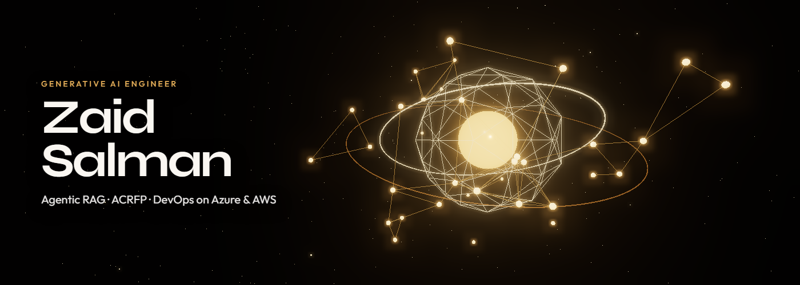

<div align="center">




<br>

<a href="https://www.linkedin.com/in/zaidsalman">
  
</a>
<a href="https://salman167.github.io">
  
</a>
<a href="mailto:zaid.cloudsre@gmail.com">
  
</a>

<br>


</div>

---

# About

I am a **Generative AI and AI Platform Engineer** with a DevOps foundation. I build production **Agentic RAG** systems and the **Agentic Cloud Reliability & FinOps Platform (ACRFP)** — multi-agent workflows that stay inside policy, approval, and observability gates.

Day to day that means LangGraph agents, FastAPI services, hybrid retrieval, and the Kubernetes, Terraform, and CI/CD path that gets those systems onto Azure and AWS.

<details open>
<summary><b>Technical snapshot</b></summary>

```bash
$ whoami
━━━━━━━━━━━━━━━━━━━━━━━━━━━━━━━━━━━━━━━━━
Name      : Zaid Salman
Role      : Generative AI Engineer | AI Platform | DevOps
Focus     : Agentic RAG, ACRFP, production LLM systems
Stack     : Python, FastAPI, LangGraph, Qdrant, AKS
Cloud     : Azure, AWS, Kubernetes, Terraform, GitHub Actions
Certs     : AWS SAA  |  AZ-104  |  AZ-400
Location  : Bengaluru, India
Status    : Building production GenAI platforms
━━━━━━━━━━━━━━━━━━━━━━━━━━━━━━━━━━━━━━━━━
```

</details>

---

# What I'm building

### ACRFP — Agentic Cloud Reliability & FinOps Platform

**[Salman167/acrfp](https://github.com/Salman167/acrfp)**

Multi-agent system on Azure AKS that watches Kubernetes and cloud signals, diagnoses reliability and cost issues, and proposes typed fixes. A guardrail proxy decides allow, require-approval, or deny. Agents do not call kubectl or ARM directly.

```
Event → API Gateway → LangGraph Orchestrator
                          │
            Diagnosis   FinOps   Remediation
                          │
                   Guardrail Proxy
                          │
              ALLOW · REQUIRE_APPROVAL · DENY
```

| Piece | What it does |
|---------|-------------|
| Diagnosis agent | Reads signals and runbooks |
| FinOps agent | Cost and waste findings |
| Remediation agent | Typed fix proposals |
| Guardrail proxy | Risk from action type + parameters |
| Approval queue | Human gate before destructive changes |

---

### Enterprise Agentic RAG Platform

**[Salman167/Enterprise-rag-platform](https://github.com/Salman167/Enterprise-rag-platform)**

Multilingual enterprise RAG for English, Arabic, French, and German. Twelve microservices cover upload, OCR, locale-aware chunking, embeddings, hybrid retrieval, citations, and feedback.

```
Users → API Gateway → Auth → RAG services → Qdrant / PostgreSQL / MinIO / Redis
                              ├── Ingest: OCR → Chunk → Embed
                              └── Query: LangGraph → Retrieve → Cite → Answer
```

| Piece | What it does |
|---------|-------------|
| Hybrid retrieval | Dense + keyword search |
| LangGraph query path | Grounded answers with citations |
| Evaluation | Langfuse tracing and RAGAS quality gates |
| Controls | JWT/RBAC, PII redaction, GDPR and PDPL region tags |
| Sources | SharePoint and Confluence style document sync |

---

### DevOps & cloud delivery

The same platforms are shipped with containers, GitOps, and infrastructure as code.

| Area | What I use it for |
|---------|-------------|
| Kubernetes | AKS / EKS, Helm, Argo CD, autoscaling |
| IaC | Terraform, Ansible |
| CI/CD | GitHub Actions, Jenkins, Azure DevOps |
| Observability | Prometheus, Grafana, Langfuse |
| FinOps | Rightsizing, lifecycle policies, stale-resource cleanup |

- **[Cloud-cost-optimization](https://github.com/Salman167/Cloud-cost-optimization)** — AWS Lambda that finds EBS snapshots no longer tied to an active instance and removes them.
- **[gh-actions](https://github.com/Salman167/gh-actions)** — GitHub Actions on a Vite app.
- **[Portfolio](https://salman167.github.io)** — short public snapshot of this work.

---

# Tech stack

### Agentic RAG & LLM engineering


### Data & services


### DevOps & cloud


### Certifications


---

# GitHub analytics

<div align="center">


</div>

---

# Current focus

```
Working on    : ACRFP guardrails and Agentic RAG quality gates
Shipping with : AKS, Helm, Argo CD, Terraform, GitHub Actions
Ask me about  : LangGraph agents, hybrid retrieval, FinOps agents, GitOps
Open to       : GenAI platform, Agentic RAG, and DevOps roles
```

---

<div align="center">

### [LinkedIn](https://www.linkedin.com/in/zaidsalman) · [Portfolio](https://salman167.github.io) · [Email](mailto:zaid.cloudsre@gmail.com)

**ACRFP · Agentic RAG · DevOps**

</div>
